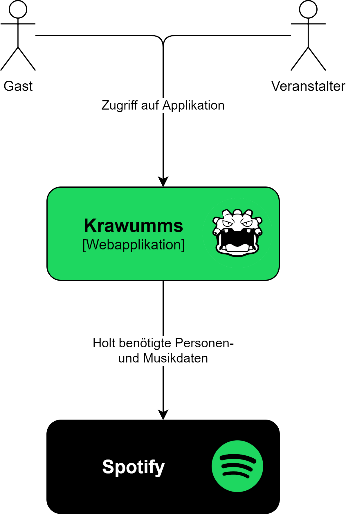

# Kontext
Die Webapplikation erlaubt jedem Gast auf einer Veranstaltung demokratisch Einfluss auf die Musikwiedergabe zu nehmen. Ein Veranstalter kann nach der Anmeldung via Spotify neue Veranstaltungen anlegen und diese mit seinen Gästen teilen. Gäste können per Sharing-Code an solchen Veranstaltungen teilnehmen, ohne sich anzumelden oder persönliche Informationen angeben zu müssen. Innerhalb einer Veranstaltung haben alle Gäste eine gemeinsame Sicht auf die aktuelle Wiedergabeliste. Jeder Gast hat die Möglichkeit neue Songs zur Wiedergabeliste hinzuzufügen und für vorhandene Songs abzustimmen. Die Wiedergabeliste wird dabei kontinuierlich aufgrund der abgegebenen Stimmen sortiert. So kann nach demokratischen Prinzipien stets dem Wunsch der Mehrheit gefolgt werden, indem jeweils die Songs mit den meisten Stimmen abgespielt werden. Für die Suche und Wiedergabe von Musik baut Krawumms auf Spotify auf. Durch diese Anbdindung wird den Nutzern Zugriff auf über 50 Millionen Songs gewährt. Da Krawumms als Webapplikation konzipiert wurde, kann diese in jedem modernen Webbrowser genutzt werden. Ausserdem passt sich die Webapplikation dynamisch an die vorhandene Bildschirmgrösse an, um möglichst viele verschiedene Gerätetypen zu unterstützen. Mit Krawumms steht ein vollumfängliches Produkt zur Verfügung, welches das gemeinsame Musikerlebnis in einer Gruppe neu definiert.

Nachfolgend ist ein Kontextdiagramm, welches eine visuelle Übersicht bietet:

## Nutzer
Die Nutzer der Webapplikation können in zwei Gruppen aufgeteilt werden:
1. Veranstalter: Personen, welche eine Spotify-Premium-Mitgliedschaft besitzen und sich bei Krawumms registriert haben.
2. Gäste: Personen, welche zu einer Veranstaltung eingeladen wurden.

## Externe Systeme
Die Anbindung von Spotify als externes System hat bedeutenden Charakter für die gesamte Applikation, da diese es erlaubt alle benötigten Musikdaten aus einer zentralen Quelle zu beziehen. Dieses externe System wird in den Architekturdiagrammen als schwarze Box dargestellt.