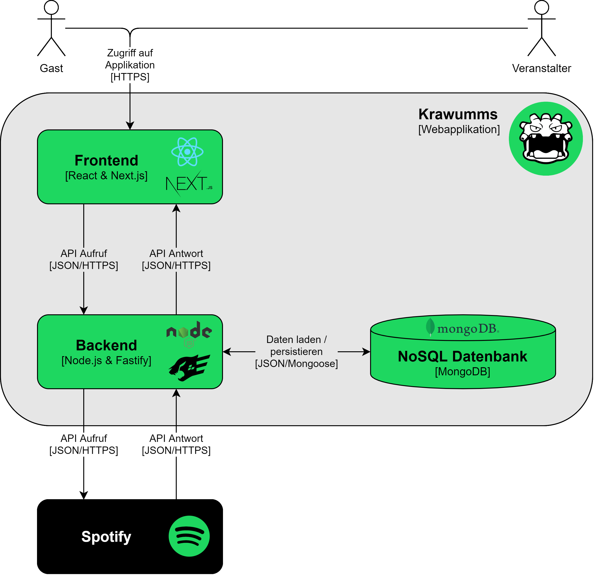
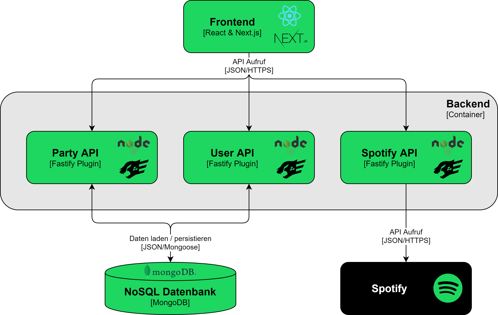

# Architektur
Dieser Abschnitt vermittelt einen Überblick über die Architektur von Krawumms.

## Context
Das Kontextdiagramm lässt sich im Abschnitt [Kontext](01.kontext.md) finden.

## Containers
Das folgende Diagramm zeigt die logischen Container, aus denen sich Krawumms zusammensetzt. Das Diagramm stellt nicht die physische Anzahl und den Standort der Container dar. Diese Informationen lassen sich in den Abschnitten [Infrastruktur Architektur](08.infrastruktur_architektur.md) und [Installation (Deployment)](09.deployment.md) finden.

### Frontend
Das Frontend ist der zentrale Einstiegspunkt in die Krawumms-Webapplikation. Es koordiniert die gesamte Interaktion mit dem Nutzer und generiert passende Aufrufe an die REST-API des Backends. Diese Aufrufe dienen einerseits dazu, Daten aus der Datenbank oder von Spotify zu laden und andererseits dienen sie dazu, neue Daten in der Datenbank zu persistieren oder auch den Login an Spotify zu delegieren.

### Backend
Das Backend ist das Herzstück der Krawumms-Webapplikation. Es beliefert das Frontend stets mit den aktuellsten Daten und nimmt von dort auch Daten entgegen, um diese weiterzuverarbeiten. Bei einer ankommenden Anfrage vom Frontend evaluiert das Backend, was genau zu tun ist und initiiert entsprechende Anfragen an die Datenbank oder an die Spotify API.

### NoSQL Datenbank
Die als zentraler Datenspeicher eingesetzte MongoDB wird verwendet, um sämtliche Informationen über Veranstaltungen, Wiedergabelisten und Abstimmungsergebnisse zu persistieren. Auf Anfrage vom Backend hin werden entweder Daten geladen oder persistiert. Die Daten werden dabei über Mongoose als JSON-Dokumente zwischen Backend und Datenbank ausgetauscht.

### Spotify
Sämtliche Musikdaten werden von Spotify über die bereitgestellte API als JSON-Dokumente bezogen. Ebenfalls ermöglicht die Nutzung der Spotify API den Zugriff auf benutzerrelevante Daten sowie die Delegation des Logins an Spotify.

## Components - Backend
Das folgende Diagramm zeigt die einzelnen Komponenten, aus denen sich das Backend zusammensetzt. Die Komponenten wurden als Fastify Plugins realisiert und stellen jeweils eine eigenständige API dar.

### Party API
Die Party API wird verwendet um Veranstaltungen zu erstellen, zu laden, zu modifizieren und zu löschen. Ausserdem werden über diese Schnittstelle die veranstaltungsspezifischen Wiedergabelisten gepflegt.

### User API
Die User API wird verwendet um Veranstalter zu erstellen, zu laden und zu löschen. Dadurch kann sichergestellt werden, dass für jeden Veranstalter immer nur die eigenen Veranstaltungen sichtbar sind.

### Spotify API
Die Spotify API wird verwendet um Songs auf Spotify zu suchen und diese anschliessend mit allen Metadaten (Titel, Album, Interpret etc.) zu laden.